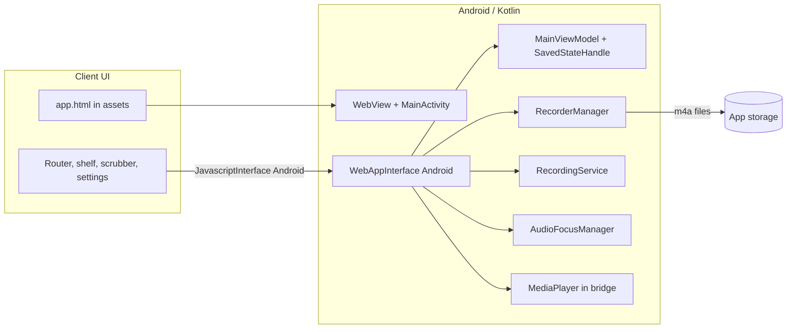

# Needle

<p align="center">
  <b>Drop the needle on your day — a voice journal that feels like a record player.</b><br/>
  A calm, neumorphic recorder for Android. Cream canvas, vinyl metaphor, and native audio under the hood.
</p>

<p align="center">
  <a href="LICENSE"></a>
  
  
  
</p>

<p align="center">
  
</p>

---

## Why it exists

Most voice memo apps look like system utilities: flat lists, harsh chrome, zero atmosphere. **Needle** is the opposite: **one quiet surface**, soft neumorphic depth, and a **vinyl-inspired** home and playback flow so capturing a thought feels like a small ritual, not a spreadsheet row. The visible product is a **WebView**-hosted SPA for fast visual iteration; **capture, files, playback, and audio focus stay native** so recording stays reliable on modern Android (including foreground `microphone` service types where the OS demands them).

---

## Features

| Area | What you get |
|------|----------------|
| **Recording** | One-tap record/stop, AAC `.m4a` in app storage, timestamped filenames |
| **Foreground session** | `RecordingService` keeps long takes honest with a visible notification (`foregroundServiceType="microphone"` on API 34+) |
| **Playback** | Native `MediaPlayer` with scrub, pause/resume, variable speed (API 23+), audio focus handling |
| **Library** | “The Library” grid from on-disk recordings; delete single clips or clear all |
| **Home shelf** | Recent strip + quick path into the archive |
| **Settings** | Client-side preferences (e.g. storage hints) via `localStorage` in the SPA |
| **State** | `MainViewModel` + `SavedStateHandle` restores route and playback path across rotation / process death |

**UX:** edge-to-edge shell, light system bars on cream `#EAE6DF`, **Playfair Display** + **Space Mono** (loaded in the WebView), unified background (no competing “planks” between scrubber and controls).

---

## Tech stack

- **UI:** `WebView` + [`app/src/main/assets/design/app.html`](app/src/main/assets/design/app.html) (vanilla HTML/CSS/JS, SPA router: home, playback, archive, settings)
- **Native:** Kotlin, `MainActivity`, `RecorderManager` (`MediaRecorder`), `RecordingService`, `AudioFocusManager`
- **Bridge:** `JavascriptInterface` named **`Android`** on `WebAppInterface` — record/stop, list recordings (JSON), play/pause/seek/speed/delete, navigation callbacks, permission flows
- **Persistence:** recordings on disk under the app’s music directory; lightweight keys in `localStorage` (`needle_settings`, `lastRecording`, `currentPlayback`); navigation/playback path in `SavedStateHandle`

---

## Architecture



**Android 13+:** **Post notifications** are part of the real-world flow (recording status). **Microphone** is requested when you start a recording, not as a cold-launch wall.

---

## Download

**[→ Needle — latest APK on GitHub Releases](https://github.com/TUHS-lab/Needle-Recorder/releases)**

1. On that page, under **Assets**, download the `.apk` file.  
2. Open it on your phone and install; if prompted, allow installation from that source (browser, Files, etc.).

---

## Build from source

Use this if you are developing or prefer to compile locally. End users can ignore this and use [Download](#download) instead.

| Requirement | Version |
|-------------|---------|
| JDK | 17 |
| `compileSdk` / `targetSdk` | 34 |
| `minSdk` | 29 |

```bash
# Debug APK
./gradlew assembleDebug        # macOS / Linux
gradlew.bat assembleDebug      # Windows
```

Output: `app/build/outputs/apk/debug/`

Install to a connected device:

```bash
./gradlew installDebug
# or
gradlew.bat installDebug
```

Open the `app` module in **Android Studio** when you need debugging, WebView inspection, or native layout tweaks.

---

## Permissions (why they’re there)

Needle asks for what a **serious** voice app needs: `RECORD_AUDIO`, `FOREGROUND_SERVICE` and `FOREGROUND_SERVICE_MICROPHONE` (so background recording matches Play policy on newer APIs), `POST_NOTIFICATIONS` (API 33+), and `INTERNET` (e.g. Google Fonts inside the WebView). The microphone feature is optional at the manifest level (`required="false"`) so the app can still install on odd form factors.

---

## Repository layout

```
app/src/main/
├── assets/design/
│   └── app.html         # All UI, styles, and client logic
├── java/com/omni/jrnl/  # MainActivity, WebAppInterface, RecorderManager,
│                        # RecordingService, AudioFocusManager, MainViewModel
└── res/                 # Theme, strings, launcher icons
```

---

## Troubleshooting

- **No waveform / can’t record:** grant **Microphone** in system settings; on Android 13+, allow **Notifications** so the foreground recording session is obvious.  
- **Playback silent:** check media volume and whether another app holds exclusive audio focus.  
- **Process killed while recording:** OEM **battery optimization** can be aggressive — exempt Needle if you routinely record long sessions in the background.

---

## License

[MIT](LICENSE) © 2026 TUHS

---

<p align="center">
  <sub><b>Needle</b> · <i>application</i> — built with a small native core and a big focus on how capturing a day should feel.</sub>
</p>
